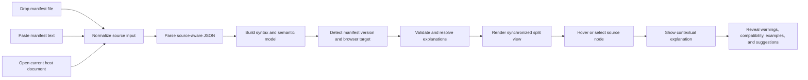
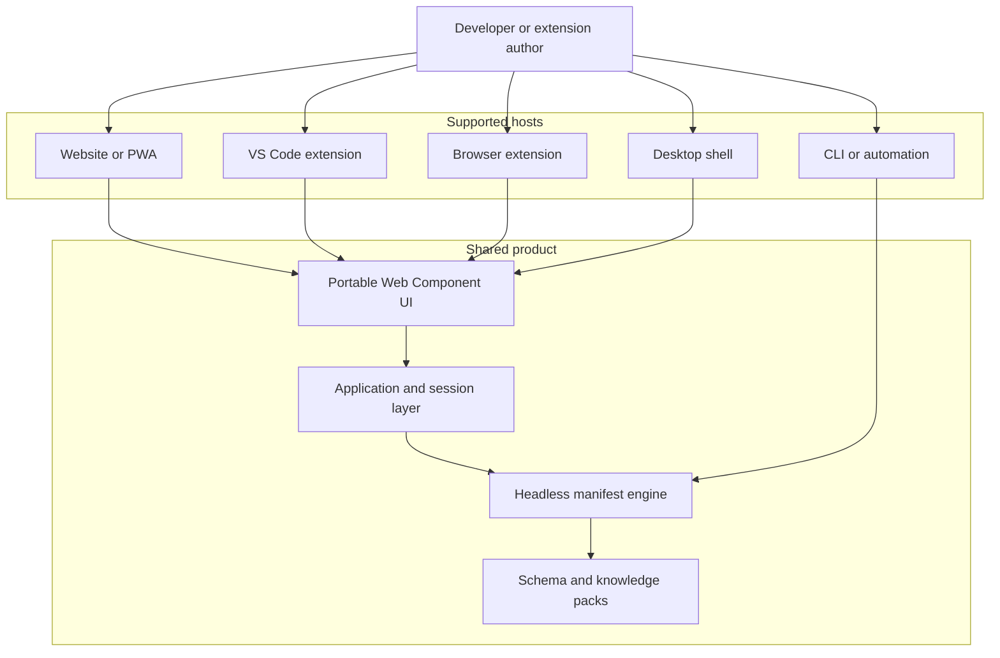
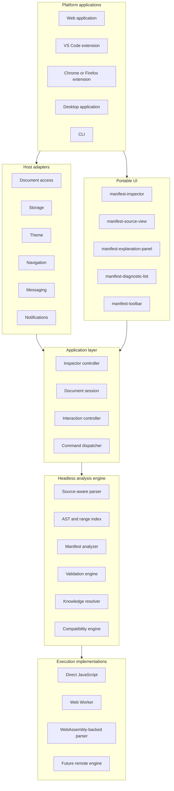
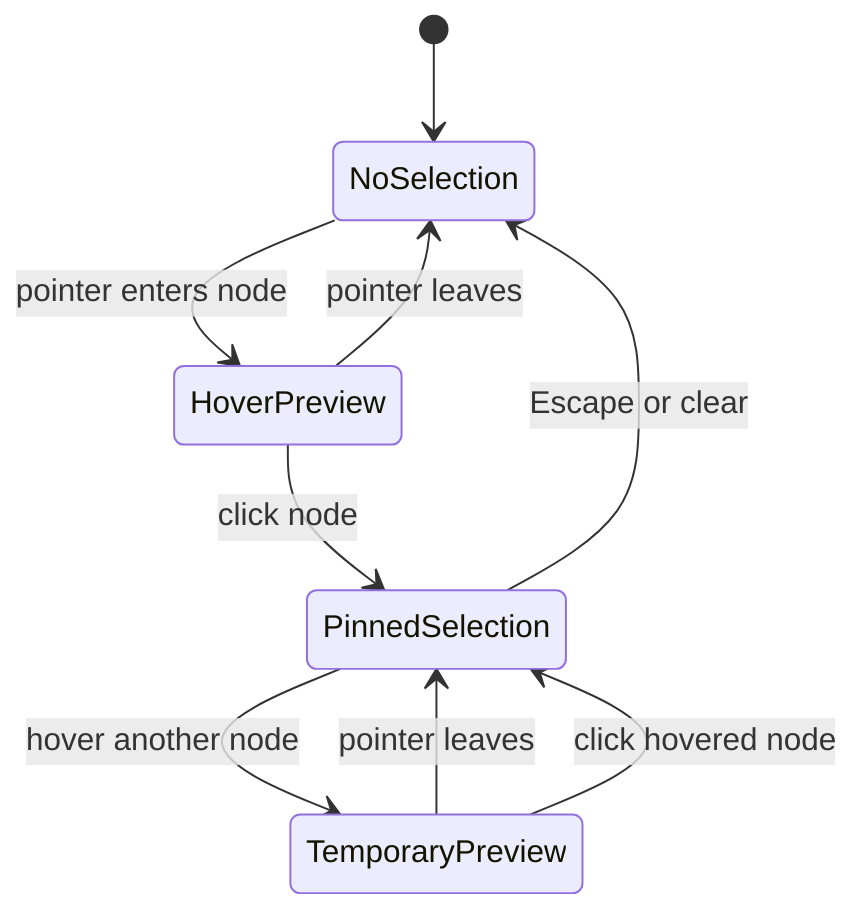
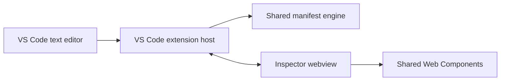

# Web Extension Manifest Inspector
## High-Level Design and Portability Architecture

**Document status:** Draft  
**Primary implementation:** TypeScript, HTML, CSS, Web Components  
**Initial deployment target:** Frontend-only web application  
**Future targets:** VS Code extension, Chromium extension, Firefox extension, desktop shell, CLI, embeddable widget  
**Backend dependency:** None for the core product

---

## Table of Contents

1. [Executive Summary](#1-executive-summary)
2. [Product Overview](#2-product-overview)
3. [Goals](#3-goals)
4. [Non-Goals](#4-non-goals)
5. [Architecture Principles](#5-architecture-principles)
6. [System Context](#6-system-context)
7. [High-Level Architecture](#7-high-level-architecture)
8. [Core Domain Model](#8-core-domain-model)
9. [Headless Analysis Engine](#9-headless-analysis-engine)
10. [Source Parsing and Mapping](#10-source-parsing-and-mapping)
11. [Manifest Analysis Pipeline](#11-manifest-analysis-pipeline)
12. [Knowledge and Schema System](#12-knowledge-and-schema-system)
13. [Validation and Diagnostics](#13-validation-and-diagnostics)
14. [Application State and Session Model](#14-application-state-and-session-model)
15. [Portable UI Architecture](#15-portable-ui-architecture)
16. [Interaction Design](#16-interaction-design)
17. [Platform Host Architecture](#17-platform-host-architecture)
18. [Typed Cross-Context Protocol](#18-typed-cross-context-protocol)
19. [Execution Models](#19-execution-models)
20. [Web Workers, Service Workers, and WebAssembly](#20-web-workers-service-workers-and-webassembly)
21. [Use of Modern JavaScript and TypeScript](#21-use-of-modern-javascript-and-typescript)
22. [Security and Privacy](#22-security-and-privacy)
23. [Performance and Scalability](#23-performance-and-scalability)
24. [Accessibility](#24-accessibility)
25. [Storage and Offline Support](#25-storage-and-offline-support)
26. [Testing Strategy](#26-testing-strategy)
27. [Build and Package Structure](#27-build-and-package-structure)
28. [Deployment Variants](#28-deployment-variants)
29. [Backend Boundary](#29-backend-boundary)
30. [Observability](#30-observability)
31. [Risks and Mitigations](#31-risks-and-mitigations)
32. [Delivery Plan](#32-delivery-plan)
33. [Architecture Decisions](#33-architecture-decisions)
34. [Open Questions](#34-open-questions)
35. [Conclusion](#35-conclusion)

---

# 1. Executive Summary

The Web Extension Manifest Inspector is a frontend-first developer tool that accepts a browser-extension manifest through file upload, drag and drop, paste, editor input, or a host platform document.

The application parses the original source text, builds a source-aware syntax tree, interprets the document as a browser-extension manifest, validates it, and presents a synchronized split view:

- **Left panel:** original manifest source with syntax highlighting, diagnostics, and interactive semantic ranges.
- **Right panel:** contextual explanation of the hovered or selected property, value, permission, compatibility rule, or validation issue.

The central architectural objective is portability. The same parsing engine, manifest knowledge, validation rules, application model, and most UI components must be reusable across:

- a normal website,
- a Progressive Web App,
- a VS Code extension,
- a Chrome or Firefox extension,
- an embeddable component,
- a desktop shell,
- a CLI,
- and a possible future backend service.

The design therefore separates the product into three major layers:

1. **Headless analysis engine**
2. **Portable Web Component UI**
3. **Thin platform-specific host adapters**

The engine does not depend on the DOM, browser globals, VS Code APIs, extension APIs, storage APIs, or any rendering technology. It accepts serializable input and returns serializable analysis snapshots.

The UI depends only on typed contracts. Platform-specific functionality such as opening files, accessing the active VS Code document, reading extension storage, applying themes, or opening external links is supplied through host capability interfaces.

---

# 2. Product Overview

## 2.1 Primary user journey



## 2.2 Core product capabilities

The first product version should support:

- dropping a local `manifest.json`,
- selecting a file,
- pasting manifest content,
- editing manifest content,
- preserving the exact original formatting,
- syntax-aware source rendering,
- manifest version detection,
- likely browser target detection,
- property and value explanations,
- permission explanations,
- schema validation,
- semantic validation,
- browser compatibility notes,
- hover and click synchronization,
- keyboard navigation,
- privacy-preserving local processing,
- exportable diagnostics.

## 2.3 Product value

The product is not merely a JSON viewer. It adds domain knowledge to a source document.

For example, the parser sees:

```json
{
  "permissions": ["tabs"]
}
```

The manifest analyzer understands:

- `permissions` is a privileged capability declaration,
- `"tabs"` is a known permission,
- the permission may expose sensitive tab information,
- it can affect installation warnings,
- `activeTab` may be a narrower alternative,
- support and behavior can differ by browser and manifest version.

---

# 3. Goals

## 3.1 Product goals

- Explain web-extension manifest files interactively.
- Preserve a precise relationship between source text and semantic meaning.
- Detect syntax, structural, semantic, security, and compatibility problems.
- Provide explanations without requiring a backend.
- Remain useful when offline.
- Make hover-based exploration fast and intuitive.
- Support keyboard and touch interaction.

## 3.2 Architecture goals

- Keep the core engine platform independent.
- Make the UI embeddable through standard browser primitives.
- Reuse the same packages across web, VS Code, and browser-extension targets.
- Keep cross-context communication typed and serializable.
- Support direct execution, Web Worker execution, and future WebAssembly implementations.
- Make domain data and validation rules independently versionable.
- Prevent platform-specific APIs from leaking into shared packages.
- Enable future support for other configuration formats without rewriting the product.

## 3.3 Engineering goals

- Use strict TypeScript.
- Use modern ECMAScript modules.
- Keep the functional core deterministic and testable.
- Keep platform effects behind explicit interfaces.
- Prefer native HTML, CSS, and browser APIs over large framework dependencies.
- Introduce advanced browser features only where they solve a measured problem.

---

# 4. Non-Goals

The first release will not attempt to provide:

- user accounts,
- cloud storage,
- permanent public share links,
- real-time collaboration,
- arbitrary remote plugins,
- AI-generated explanations,
- automatic publishing to extension stores,
- complete extension source-code analysis,
- runtime behavior tracing,
- full Chrome-to-Firefox source conversion,
- automatic repair of every invalid manifest,
- remote execution of untrusted code.

These features may be added later through explicit adapters or services.

---

# 5. Architecture Principles

## 5.1 Platform-independent core

The analysis engine must not import or access:

- `window`,
- `document`,
- `HTMLElement`,
- `localStorage`,
- `indexedDB`,
- `chrome.*`,
- `browser.*`,
- VS Code APIs,
- Node.js filesystem APIs,
- service-worker globals.

## 5.2 Ports and adapters

The product should depend on abstractions such as:

```ts
interface DocumentHost {
  open(): Promise<DocumentInput | null>;
}
```

Each platform provides its own implementation.

## 5.3 Functional core, imperative shell

Pure functions perform:

- tokenization,
- parsing,
- AST traversal,
- path generation,
- manifest detection,
- schema validation,
- semantic rule evaluation,
- explanation resolution.

Imperative code performs:

- file access,
- DOM updates,
- clipboard access,
- storage,
- messaging,
- focus,
- scrolling,
- host integration.

## 5.4 Serializable boundaries

Data crossing a process, worker, webview, extension, iframe, or backend boundary must be plain structured data.

Do not rely on:

- class instances,
- methods,
- DOM nodes,
- closures,
- proxies,
- cyclic object graphs,
- runtime-specific handles.

## 5.5 Capability-based hosts

The UI should ask what a host can do, rather than asking which host it is running inside.

Prefer:

```ts
if (host.capabilities.canSaveFiles) {
  showSaveAction();
}
```

Avoid:

```ts
if (platform === "vscode") {
  showSaveAction();
}
```

## 5.6 Preserve original source

The inspector must render from the original source text and source ranges.

It must not replace the source with:

```ts
JSON.stringify(parsedObject, null, 2);
```

That would destroy the user's formatting and break source-to-node mapping.

## 5.7 Progressive enhancement

The product must work with a simple direct engine and basic Web Components.

Web Workers, service workers, WebAssembly, IndexedDB, and advanced APIs are optional enhancements behind stable interfaces.

---

# 6. System Context



The CLI target may use only the engine and omit the shared UI.

---

# 7. High-Level Architecture



## 7.1 Dependency direction

```text
contracts
   ↑
parser / knowledge
   ↑
manifest-domain
   ↑
core
   ↑
application
   ↑
ui-components
   ↑
platform applications
```

Platform packages may depend on shared packages. Shared packages must never depend on a platform package.

---

# 8. Core Domain Model

The central entity is not the parsed JSON object. It is a source-linked semantic document.

## 8.1 Source document

```ts
export interface SourceDocument {
  readonly documentId: DocumentId;
  readonly uri?: string;
  readonly fileName?: string;
  readonly language: "json" | "jsonc";
  readonly sourceText: string;
  readonly version: number;
}
```

## 8.2 Source range

```ts
export interface SourceRange {
  readonly start: number;
  readonly end: number;
  readonly startLine: number;
  readonly startColumn: number;
  readonly endLine: number;
  readonly endColumn: number;
}
```

Character offsets are the canonical identity for source mapping. Line and column information is stored for display and integration with editors.

## 8.3 Syntax node

```ts
export type SyntaxNode =
  | ObjectSyntaxNode
  | ArraySyntaxNode
  | PropertySyntaxNode
  | StringSyntaxNode
  | NumberSyntaxNode
  | BooleanSyntaxNode
  | NullSyntaxNode;
```

Every node includes:

```ts
export interface SyntaxNodeBase {
  readonly id: SyntaxNodeId;
  readonly kind: SyntaxNodeKind;
  readonly range: SourceRange;
  readonly parentId: SyntaxNodeId | null;
}
```

## 8.4 Semantic node

```ts
export interface SemanticNode {
  readonly id: NodeId;
  readonly syntaxNodeId: SyntaxNodeId;
  readonly kind: SemanticNodeKind;
  readonly path: ManifestPath;
  readonly normalizedPath: ManifestPathPattern;
  readonly key?: string;
  readonly value?: JsonValue;
  readonly sourceRange: SourceRange;
  readonly keyRange?: SourceRange;
  readonly valueRange?: SourceRange;
  readonly parentId: NodeId | null;
  readonly childIds: readonly NodeId[];
  readonly explanationRef?: ExplanationRef;
  readonly diagnosticIds: readonly DiagnosticId[];
}
```

Example paths:

```text
background
background.service_worker
content_scripts[0].matches[1]
```

Normalized paths:

```text
background
background.service_worker
content_scripts[].matches[]
```

Normalized paths allow one rule or explanation to match every item in an array.

## 8.5 Manifest metadata

```ts
export interface ManifestMetadata {
  readonly detectedVersion: 2 | 3 | "unknown";
  readonly selectedVersion: 2 | 3 | "auto";
  readonly detectedTargets: readonly BrowserTargetDetection[];
  readonly selectedTarget: BrowserTarget | "auto";
}
```

## 8.6 Analysis snapshot

```ts
export interface AnalysisSnapshot {
  readonly document: SourceDocument;
  readonly parse: ParseSnapshot;
  readonly manifest: ManifestMetadata;
  readonly nodes: readonly SemanticNode[];
  readonly diagnostics: readonly Diagnostic[];
  readonly explanations: Readonly<Record<NodeId, Explanation>>;
  readonly createdAt: number;
}
```

The snapshot is immutable and serializable.

---

# 9. Headless Analysis Engine

## 9.1 Public engine contract

```ts
export interface ManifestEngine {
  analyze(
    request: AnalyzeManifestRequest,
    signal?: AbortSignal
  ): Promise<AnalysisSnapshot>;
}
```

```ts
export interface AnalyzeManifestRequest {
  readonly document: SourceDocument;
  readonly options: AnalysisOptions;
}
```

```ts
export interface AnalysisOptions {
  readonly targetBrowser: BrowserTarget | "auto";
  readonly manifestVersion: 2 | 3 | "auto";
  readonly validationMode: "standard" | "strict";
}
```

## 9.2 Implementations

```ts
export class DirectManifestEngine implements ManifestEngine {}

export class WorkerManifestEngine implements ManifestEngine {}

export class WasmManifestEngine implements ManifestEngine {}

export class RemoteManifestEngine implements ManifestEngine {}
```

The application and UI depend only on `ManifestEngine`.

## 9.3 Processing pipeline

```mermaid
flowchart LR
    Source[SourceDocument]
    Parse[Parse source]
    Index[Build range and path indexes]
    Detect[Detect manifest metadata]
    Schema[Resolve schemas]
    Semantic[Build semantic nodes]
    Validate[Run validators]
    Explain[Resolve explanations]
    Snapshot[AnalysisSnapshot]

    Source --> Parse
    Parse --> Index
    Index --> Detect
    Detect --> Schema
    Schema --> Semantic
    Semantic --> Validate
    Validate --> Explain
    Explain --> Snapshot
```



## 9.4 Cancellation and stale result protection

Live editing may trigger multiple analyses. The previous analysis should be cancelled when possible.

```ts
let activeController: AbortController | null = null;

async function analyze(document: SourceDocument) {
  activeController?.abort();

  const controller = new AbortController();
  activeController = controller;

  const snapshot = await engine.analyze(
    { document, options },
    controller.signal
  );

  if (controller.signal.aborted) {
    return;
  }

  session.acceptSnapshot(snapshot);
}
```

Every request should include a document version or request identifier. Results for outdated versions must be ignored.

---

# 10. Source Parsing and Mapping

## 10.1 Why `JSON.parse` is insufficient

`JSON.parse` returns values but discards:

- source positions,
- comments,
- token identity,
- original formatting,
- partial-document information,
- detailed syntax recovery,
- key ranges,
- array-item ranges.

The inspector requires a source-aware parser.

## 10.2 Parser contract

```ts
export interface SourceParser {
  parse(
    document: SourceDocument,
    options?: ParseOptions
  ): ParseSnapshot;
}
```

```ts
export interface ParseSnapshot {
  readonly root: SyntaxNode | null;
  readonly tokens: readonly SourceToken[];
  readonly syntaxNodes: readonly SyntaxNode[];
  readonly diagnostics: readonly SyntaxDiagnostic[];
}
```

## 10.3 JSON and JSONC

The initial manifest format is JSON. A tolerant JSONC mode may be useful for editor integrations because developers often temporarily add comments or trailing commas.

The parser should support these modes explicitly:

```ts
type SourceLanguage = "json" | "jsonc";
```

A document interpreted as strict JSON may still be parsed tolerantly while reporting strictness diagnostics.

## 10.4 Source range index

The system should create indexes for:

- node ID to range,
- character offset to smallest matching node,
- line to diagnostics,
- normalized path to semantic nodes,
- parent to children,
- node to explanation.

```ts
export interface SourceRangeIndex {
  findSmallestNodeAtOffset(offset: number): NodeId | null;
  findNodesInRange(range: SourceRange): readonly NodeId[];
}
```

## 10.5 Overlapping ranges

A property range may contain a key range and a value range. The most specific range wins during hover resolution.

```text
property:   "permissions": ["tabs"]
key:        "permissions"
value:                     ["tabs"]
item:                        "tabs"
```

Hovering `"tabs"` should resolve to the permission item rather than the containing property.

## 10.6 Invalid and partial input

The parser must return a result even when the document is invalid.

```ts
{
  root: partialRoot,
  tokens,
  syntaxNodes,
  diagnostics
}
```

The UI can still render the source and highlight errors. Full semantic analysis may stop if the root structure is unusable.

---

# 11. Manifest Analysis Pipeline

## 11.1 Manifest version detection

Primary signal:

```json
{
  "manifest_version": 3
}
```

Possible states:

```ts
type DetectedManifestVersion = 2 | 3 | "missing" | "invalid";
```

User override must remain separate from detected value.

## 11.2 Browser target detection

Browser detection is probabilistic because many manifests are intentionally cross-browser.

Detection signals may include:

- `browser_specific_settings`,
- `minimum_chrome_version`,
- Firefox-specific keys,
- Chromium-specific keys,
- Safari-specific keys,
- unsupported combinations,
- extension API namespace assumptions.

```ts
export interface BrowserTargetDetection {
  readonly target: BrowserTarget;
  readonly confidence: number;
  readonly evidence: readonly DetectionEvidence[];
}
```

The UI should label inferred results clearly:

```text
Likely target: Firefox
Confidence: High
Evidence: browser_specific_settings.gecko
```

## 11.3 Semantic node construction

The semantic analyzer maps syntax nodes to manifest concepts.

```text
JSON property
    ↓
normalized path
    ↓
schema definition
    ↓
manifest semantic node
    ↓
explanation and diagnostics
```

## 11.4 Unknown properties

Unknown properties should not always be treated as errors. They may be:

- misspelled,
- browser-specific,
- version-specific,
- experimental,
- custom metadata,
- unsupported by the selected target.

The diagnostic should express uncertainty and context.

---

# 12. Knowledge and Schema System

## 12.1 Separation from UI

Explanations, compatibility information, examples, and validation metadata must not be hardcoded inside UI components.

## 12.2 Knowledge registry

```ts
export interface ManifestDefinition {
  readonly path: ManifestPathPattern;
  readonly title: string;
  readonly summary: string;
  readonly expectedType?: JsonType;
  readonly category: ManifestCategory;
  readonly versions: readonly ManifestVersion[];
  readonly browsers?: readonly BrowserSupportDefinition[];
  readonly values?: Readonly<Record<string, ValueDefinition>>;
  readonly examples?: readonly ManifestExample[];
  readonly relatedPaths?: readonly ManifestPathPattern[];
}
```

## 12.3 Resolver strategy

For a node such as:

```json
{
  "permissions": ["tabs"]
}
```

Resolution order:

1. exact normalized path and value,
2. exact normalized path,
3. parent property,
4. value-type definition,
5. unknown-property fallback.

```ts
knowledgeResolver.resolve({
  path: "permissions[]",
  value: "tabs",
  version: 3,
  browser: "chrome"
});
```

## 12.4 Knowledge packs

```text
knowledge/
├── common/
├── manifest-v2/
├── manifest-v3/
├── permissions/
├── chrome/
├── firefox/
├── edge/
└── safari/
```

The build may combine these into generated, typed, immutable data modules.

## 12.5 Generated data

Generators can convert authoritative schema or compatibility sources into optimized TypeScript modules during the build.

Generated files should contain a header such as:

```text
This file is generated. Do not edit manually.
```

The runtime product must not depend on a build generator being available.

---

# 13. Validation and Diagnostics

## 13.1 Diagnostic categories

```ts
type DiagnosticKind =
  | "syntax"
  | "schema"
  | "semantic"
  | "compatibility"
  | "security"
  | "recommendation";
```

## 13.2 Severity levels

```ts
type DiagnosticSeverity =
  | "error"
  | "warning"
  | "information"
  | "suggestion";
```

## 13.3 Diagnostic model

```ts
export interface Diagnostic {
  readonly id: DiagnosticId;
  readonly code: string;
  readonly kind: DiagnosticKind;
  readonly severity: DiagnosticSeverity;
  readonly message: string;
  readonly explanation?: string;
  readonly suggestion?: string;
  readonly sourceRange?: SourceRange;
  readonly nodeId?: NodeId;
  readonly related?: readonly RelatedDiagnosticInformation[];
  readonly fix?: ManifestFix;
}
```

## 13.4 Validation layers

### Syntax validation

Examples:

- missing comma,
- trailing comma in strict JSON,
- unclosed object,
- invalid string escape,
- malformed number.

### Structural validation

Examples:

- wrong value type,
- missing required property,
- invalid enum value,
- unexpected object shape.

### Semantic validation

Examples:

- `background.scripts` used in Manifest V3,
- unsupported property for the selected browser,
- invalid permission combination,
- version-specific property mismatch.

### Cross-field validation

Examples:

- a property requires another property,
- two fields conflict,
- permission breadth exceeds the feature requirement,
- a resource is declared but unreachable,
- an action and background configuration imply lifecycle caveats.

## 13.5 Rule engine

```ts
export interface ManifestRule {
  readonly id: string;

  appliesTo(context: RuleContext): boolean;

  evaluate(
    context: RuleContext
  ): Iterable<Diagnostic>;
}
```

Generators are appropriate for returning diagnostics lazily:

```ts
function* evaluate(context: RuleContext): Generator<Diagnostic> {
  const node = context.findOne("background.scripts");

  if (!node) {
    return;
  }

  yield {
    id: createDiagnosticId(),
    code: "MV3_BACKGROUND_SCRIPTS",
    kind: "semantic",
    severity: "error",
    message: "Manifest V3 uses background.service_worker.",
    nodeId: node.id,
    sourceRange: node.sourceRange
  };
}
```

## 13.6 Fix model

Automatic fixes are optional and should be represented as text edits.

```ts
export interface ManifestFix {
  readonly title: string;
  readonly edits: readonly SourceTextEdit[];
}
```

```ts
export interface SourceTextEdit {
  readonly range: SourceRange;
  readonly newText: string;
}
```

This format maps naturally to web editors, VS Code workspace edits, and CLI patch output.

---

# 14. Application State and Session Model

## 14.1 Persistent session state

```ts
export interface InspectorState {
  readonly status: InspectorStatus;
  readonly document: SourceDocument | null;
  readonly snapshot: AnalysisSnapshot | null;
  readonly selectedNodeId: NodeId | null;
  readonly hoveredNodeId: NodeId | null;
  readonly focusedNodeId: NodeId | null;
  readonly selectedDiagnosticId: DiagnosticId | null;
  readonly options: AnalysisOptions;
  readonly layout: InspectorLayoutState;
}
```

## 14.2 Effective active node

Hover is temporary. Selection is persistent.

```ts
const activeNodeId =
  state.hoveredNodeId ?? state.selectedNodeId;
```

When hover ends, the right panel returns to the pinned selection.

## 14.3 State transitions

Use explicit actions and pure reducers.

```ts
export type InspectorAction =
  | { readonly type: "document/loaded"; readonly document: SourceDocument }
  | { readonly type: "analysis/started"; readonly version: number }
  | { readonly type: "analysis/completed"; readonly snapshot: AnalysisSnapshot }
  | { readonly type: "analysis/failed"; readonly error: SerializedError }
  | { readonly type: "node/hovered"; readonly nodeId: NodeId | null }
  | { readonly type: "node/selected"; readonly nodeId: NodeId | null }
  | { readonly type: "diagnostic/selected"; readonly diagnosticId: DiagnosticId }
  | { readonly type: "options/changed"; readonly options: AnalysisOptions };
```

Proxy-based deep mutation should not be the main state model because it complicates:

- worker serialization,
- debugging,
- replay,
- testing,
- persistence,
- identity.

A `Proxy` may be used locally inside an isolated UI component when it offers a clear benefit.

---

# 15. Portable UI Architecture

## 15.1 Web Components

The reusable UI should be implemented using Custom Elements, Shadow DOM, templates, slots, CSS custom properties, and custom events.

Primary component:

```html
<manifest-inspector></manifest-inspector>
```

Internal composition:

```html
<manifest-inspector>
  <manifest-toolbar></manifest-toolbar>

  <manifest-split-view>
    <manifest-source-view slot="source"></manifest-source-view>
    <manifest-explanation-panel slot="details"></manifest-explanation-panel>
  </manifest-split-view>

  <manifest-status-bar></manifest-status-bar>
</manifest-inspector>
```

## 15.2 Component responsibilities

### `<manifest-inspector>`

- session lifecycle,
- dependency injection,
- high-level state coordination,
- public component API.

### `<manifest-source-view>`

- source rendering,
- syntax token presentation,
- node highlighting,
- diagnostics,
- hover, click, and keyboard events.

### `<manifest-explanation-panel>`

- node title,
- summary,
- current value interpretation,
- compatibility,
- security implications,
- examples,
- related properties,
- diagnostic details.

### `<manifest-diagnostic-list>`

- grouped errors and warnings,
- navigation to source,
- fix actions,
- filtering.

### `<manifest-split-view>`

- resizing,
- responsive layout,
- collapsed mobile mode,
- persisted panel ratio.

## 15.3 Dependency injection

The component must not create its own platform integrations.

```ts
const inspector =
  document.querySelector<ManifestInspectorElement>(
    "manifest-inspector"
  )!;

inspector.engine = engine;
inspector.host = host;
```

## 15.4 Public component API

```ts
export interface ManifestInspectorElement extends HTMLElement {
  engine: ManifestEngine;
  host: InspectorHost;

  loadDocument(document: SourceDocument): Promise<void>;
  selectNode(nodeId: NodeId): void;
  revealDiagnostic(diagnosticId: DiagnosticId): void;
  exportReport(): Promise<Blob>;
}
```

## 15.5 Custom events

```ts
type ManifestInspectorEventMap = {
  "manifest-document-loaded": CustomEvent<SourceDocument>;
  "manifest-analysis-completed": CustomEvent<AnalysisSnapshot>;
  "manifest-node-selected": CustomEvent<{ nodeId: NodeId }>;
  "manifest-diagnostic-selected": CustomEvent<{ diagnosticId: DiagnosticId }>;
};
```

Use composed custom events when the host must observe events across Shadow DOM boundaries.

## 15.6 Styling contract

Expose semantic CSS variables:

```css
:host {
  --mi-color-background: Canvas;
  --mi-color-surface: Canvas;
  --mi-color-text: CanvasText;
  --mi-color-muted: GrayText;
  --mi-color-border: color-mix(in srgb, CanvasText 18%, transparent);
  --mi-font-ui: system-ui, sans-serif;
  --mi-font-code: ui-monospace, monospace;
  --mi-panel-radius: 0.5rem;
}
```

Expose selected internals with `part`:

```html
<section part="explanation-panel"></section>
```

Host styling:

```css
manifest-inspector::part(explanation-panel) {
  border-inline-start: 1px solid var(--host-border-color);
}
```

---

# 16. Interaction Design

## 16.1 Hover and selection



## 16.2 Recommended behavior

- Hover previews an explanation.
- Click pins an explanation.
- Leaving a hovered node restores the pinned explanation.
- Hovering the explanation highlights its source range.
- Clicking a diagnostic reveals and selects the related source.
- Keyboard navigation moves through semantic nodes.
- Touch uses tap selection rather than hover.
- Double click may open deeper documentation or editing actions later.

## 16.3 Source rendering

The rendered source must retain the exact original text.

Conceptual output:

```html
<pre>
  <code>
    <span data-node-id="node-name-key">"name"</span>
    <span>:</span>
    <span data-node-id="node-name-value">"My Extension"</span>
  </code>
</pre>
```

Use event delegation on the source container rather than one listener per token.

## 16.4 Large nested structures

The explanation panel should display a breadcrumb:

```text
content_scripts → item 1 → matches → item 2
```

The source view may support folding later, but folding must not change canonical source offsets.

---

# 17. Platform Host Architecture

## 17.1 Host contract

```ts
export interface InspectorHost {
  readonly capabilities: HostCapabilities;
  readonly documents: DocumentHost;
  readonly storage: StorageHost;
  readonly clipboard: ClipboardHost;
  readonly theme: ThemeHost;
  readonly navigation: NavigationHost;
  readonly notifications: NotificationHost;
  readonly messaging?: MessagingHost;
}
```

## 17.2 Host capabilities

```ts
export interface HostCapabilities {
  readonly canOpenFiles: boolean;
  readonly canSaveFiles: boolean;
  readonly canWatchDocumentChanges: boolean;
  readonly canReadClipboard: boolean;
  readonly canWriteClipboard: boolean;
  readonly canOpenExternalLinks: boolean;
  readonly canPersistSessions: boolean;
  readonly supportsNativeDiagnostics: boolean;
  readonly supportsNativeQuickFixes: boolean;
}
```

## 17.3 Document host

```ts
export interface DocumentHost {
  open(): Promise<SourceDocument | null>;

  save?(
    document: SourceDocument
  ): Promise<void>;

  watch?(
    listener: (change: DocumentChange) => void
  ): Disposable;
}
```

## 17.4 Web host

Possible implementations:

- file input,
- drag and drop,
- clipboard paste,
- File System Access API where supported,
- IndexedDB persistence,
- browser theme detection.

## 17.5 VS Code host

The VS Code extension should not be reduced to a webview wrapper.

The shared engine can power:

- editor diagnostics,
- hover providers,
- code actions,
- quick fixes,
- commands,
- a detailed inspector webview.

Architecture:



The webview and extension host communicate through the typed message protocol.

## 17.6 Browser extension host

Suggested placement:

```text
extension/
├── side-panel or extension page
│   ├── shared Web Components
│   └── engine or worker client
├── service worker
│   ├── extension events
│   ├── privileged APIs
│   └── storage and messaging
└── optional content script
    └── page-level integration only
```

The extension service worker should not own long-lived inspector UI state.

## 17.7 Desktop shell

An Electron, Tauri, or similar shell can provide a `DocumentHost` backed by native filesystem APIs while reusing the same UI and engine.

## 17.8 CLI

The CLI imports the engine directly and renders:

- JSON diagnostics,
- text reports,
- exit codes,
- machine-readable output.

No DOM package is needed.

---

# 18. Typed Cross-Context Protocol

The same protocol can serve:

- UI to Web Worker,
- VS Code webview to extension host,
- extension page to extension service worker,
- content script to extension,
- iframe to parent,
- frontend to a future backend.

## 18.1 Request envelope

```ts
export interface RequestEnvelope<TType extends string, TPayload> {
  readonly id: RequestId;
  readonly type: TType;
  readonly payload: TPayload;
}
```

## 18.2 Response envelope

```ts
export type ResponseEnvelope<T> =
  | {
      readonly requestId: RequestId;
      readonly ok: true;
      readonly payload: T;
    }
  | {
      readonly requestId: RequestId;
      readonly ok: false;
      readonly error: SerializedError;
    };
```

## 18.3 Events

```ts
export type InspectorEvent =
  | {
      readonly type: "document/changed";
      readonly document: SourceDocument;
    }
  | {
      readonly type: "theme/changed";
      readonly theme: ThemeDefinition;
    }
  | {
      readonly type: "host/disposed";
    };
```

## 18.4 Protocol requirements

- version the protocol,
- validate untrusted messages,
- reject unknown message types,
- include request IDs,
- serialize errors,
- support cancellation,
- avoid arbitrary code execution,
- avoid transmitting unnecessary document contents.

---

# 19. Execution Models

## 19.1 Direct execution

Best for:

- initial implementation,
- small manifests,
- tests,
- CLI,
- environments where workers are unavailable.

```ts
const engine = new DirectManifestEngine(dependencies);
```

## 19.2 Web Worker execution

Best for:

- continuous editing,
- large knowledge packs,
- tolerant parsing,
- keeping the UI responsive,
- future support for larger configuration files.

```ts
const engine = new WorkerManifestEngine(
  new Worker(
    new URL("./manifest.worker.js", import.meta.url),
    { type: "module" }
  )
);
```

## 19.3 WebAssembly-backed execution

Best only after measurement shows value or when reusing a mature parser implemented in Rust, C++, or another WebAssembly-capable language.

The engine contract remains unchanged.

## 19.4 Remote execution

A future remote engine may provide:

- centrally updated rules,
- organization policies,
- AI explanations,
- team features,
- large repository analysis.

The local engine remains the default for privacy and offline operation.

---

# 20. Web Workers, Service Workers, and WebAssembly

## 20.1 Web Worker

Use for compute:

- parsing,
- AST generation,
- validation,
- compatibility analysis,
- rule evaluation.

Do not use a Web Worker for DOM access.

## 20.2 Website service worker

Use for:

- offline application shell,
- caching static assets,
- caching schema and knowledge packs,
- update control,
- PWA installation.

Do not use it as a persistent computation thread.

## 20.3 Browser-extension service worker

Use for:

- extension lifecycle events,
- commands,
- browser APIs,
- storage coordination,
- cross-context messaging.

Do not depend on its in-memory state surviving.

## 20.4 WebAssembly

Keep these interfaces replaceable:

```ts
interface SourceParser {
  parse(document: SourceDocument): ParseSnapshot;
}
```

Implementations:

```ts
class TypeScriptJsonParser implements SourceParser {}
class WasmJsonParser implements SourceParser {}
```

Use WebAssembly when one or more of these are true:

- a mature parser is already available,
- incremental parsing is required,
- tolerant error recovery is difficult in TypeScript,
- performance measurements show parsing is a bottleneck,
- the project expands to larger languages or formats.

---

# 21. Use of Modern JavaScript and TypeScript

## 21.1 TypeScript

Use strict TypeScript throughout shared packages.

Recommended baseline:

```json
{
  "compilerOptions": {
    "target": "ES2024",
    "module": "ESNext",
    "moduleResolution": "Bundler",
    "strict": true,
    "noUncheckedIndexedAccess": true,
    "exactOptionalPropertyTypes": true,
    "useDefineForClassFields": true,
    "isolatedModules": true,
    "verbatimModuleSyntax": true
  }
}
```

Platform builds may lower the target when required.

## 21.2 Branded identifiers

```ts
type Brand<T, Name extends string> =
  T & { readonly __brand: Name };

type NodeId = Brand<string, "NodeId">;
type DiagnosticId = Brand<string, "DiagnosticId">;
type DocumentId = Brand<string, "DocumentId">;
```

This prevents accidental ID mixing.

## 21.3 Discriminated unions

Use discriminated unions for:

- syntax nodes,
- diagnostics,
- requests,
- responses,
- actions,
- host events.

## 21.4 Exhaustive handling

```ts
function assertNever(value: never): never {
  throw new Error(`Unexpected value: ${String(value)}`);
}
```

## 21.5 `satisfies`

Use `satisfies` for schema and knowledge definitions so literals remain narrow while the complete structure is checked.

```ts
const definitions = {
  tabs: {
    risk: "medium",
    title: "Tabs permission"
  }
} satisfies PermissionDefinitionMap;
```

## 21.6 Generators

Appropriate uses:

- AST traversal,
- semantic tree traversal,
- rule output,
- diagnostics iteration,
- ancestor and descendant iteration.

```ts
function* walk(node: SyntaxNode): Generator<SyntaxNode> {
  yield node;

  for (const child of node.children) {
    yield* walk(child);
  }
}
```

## 21.7 Proxy

Possible limited uses:

- local component reactivity,
- development-time mutation warnings,
- lazy lookup facades.

Avoid Proxy for:

- engine snapshots,
- cross-worker data,
- protocol messages,
- persisted state,
- primary application state.

## 21.8 Modern HTML and CSS

Recommended capabilities:

- Custom Elements,
- Shadow DOM,
- `<template>`,
- slots,
- CSS custom properties,
- container queries,
- logical properties,
- `color-mix`,
- `:has()` where progressive enhancement is acceptable,
- constructable stylesheets where supported by target environments,
- native popovers for lightweight contextual UI,
- native dialog where appropriate,
- `ResizeObserver`,
- `IntersectionObserver`,
- `AbortController`.

Every feature should have a compatibility strategy for VS Code webviews and browser-extension targets.

---

# 22. Security and Privacy

## 22.1 Trust boundary

Manifest input is untrusted text.

Never use:

```ts
eval(sourceText);
new Function(sourceText);
```

## 22.2 DOM injection

Never assign raw source to `innerHTML`.

Use text nodes or correctly escaped syntax tokens.

```ts
element.textContent = sourceText;
```

## 22.3 Prototype pollution

Do not merge manifest objects into application configuration.

Avoid:

```ts
Object.assign(config, parsedManifest);
```

Treat parsed content as isolated data.

Use `Map`, arrays, immutable records, or null-prototype objects where appropriate.

## 22.4 File limits

Recommended default safeguards:

- accept text-based JSON,
- warn when filename is unexpected,
- enforce a configurable maximum size,
- use UTF-8,
- reject binary input,
- avoid recursively importing external files in the MVP.

## 22.5 External navigation

External links should use host navigation capabilities.

In browser UI:

```html
<a target="_blank" rel="noopener noreferrer"></a>
```

## 22.6 Cross-context messages

Validate every incoming message at runtime. TypeScript types alone do not protect runtime boundaries.

## 22.7 Privacy

Default product promise:

> Manifest content is processed locally and is not uploaded.

Any future remote feature must be explicit and opt-in.

---

# 23. Performance and Scalability

## 23.1 Expected document size

Most extension manifests are small. Direct TypeScript execution should be adequate for the MVP.

## 23.2 Live editing

Suggested flow:

```text
keystroke
    ↓
debounce 150–300 ms
    ↓
cancel previous analysis
    ↓
parse and analyze new document version
    ↓
ignore stale results
```

Hover interactions must never trigger parsing.

## 23.3 Rendering strategy

Avoid rerendering the entire source document on every hover.

Use targeted DOM updates:

- remove previous active class,
- add active class to the new node,
- update explanation panel,
- leave token DOM intact.

## 23.4 Virtualization

Not required for normal manifests. Keep source rendering behind an interface so virtualization can be added for larger future formats.

## 23.5 Knowledge loading

Possible strategies:

- bundle common definitions,
- lazy-load browser-specific packs,
- cache packs with a service worker,
- tree-shake unused platform data,
- version packs independently.

## 23.6 Performance metrics

Track locally during development:

- parse duration,
- semantic analysis duration,
- rule evaluation duration,
- render duration,
- worker transfer duration,
- input-to-explanation latency.

WebAssembly or worker migration should be justified by these measurements.

---

# 24. Accessibility

Hover cannot be the only interaction.

## 24.1 Keyboard behavior

Recommended:

- `Tab`: move among primary controls and semantic properties,
- `ArrowDown`: next semantic node,
- `ArrowUp`: previous semantic node,
- `ArrowRight`: enter child,
- `ArrowLeft`: move to parent,
- `Enter`: pin explanation,
- `Escape`: clear temporary state or selection.

## 24.2 Focus

- visible focus rings,
- source nodes exposed as focusable interactive elements,
- focus preserved across analysis updates where possible,
- diagnostics announce changes through an ARIA live region.

## 24.3 Touch

- tap selects,
- second tap may open expanded detail,
- no required hover-only content.

## 24.4 Color

Diagnostics must not rely on color alone. Use icons, labels, underlines, and text.

## 24.5 Reduced motion and contrast

Respect:

- `prefers-reduced-motion`,
- `prefers-contrast`,
- forced-colors mode,
- host-provided themes.

---

# 25. Storage and Offline Support

## 25.1 Web storage adapter

### `localStorage`

Suitable for:

- theme preference,
- split-view ratio,
- selected browser target,
- small UI settings.

### IndexedDB

Suitable for:

- recent documents,
- saved sessions,
- cached reports,
- knowledge packs,
- analysis history.

## 25.2 VS Code storage

Use:

- workspace state,
- global state,
- workspace files where explicitly requested.

## 25.3 Browser-extension storage

Use:

- `storage.local`,
- `storage.sync` only for small portable settings,
- IndexedDB inside extension pages where appropriate.

## 25.4 Offline application

A website service worker may cache:

- HTML shell,
- JavaScript bundles,
- CSS,
- knowledge packs,
- schemas,
- example manifests.

---

# 26. Testing Strategy

## 26.1 Unit tests

### Parser

- exact source ranges,
- string escapes,
- Unicode,
- malformed JSON,
- nested arrays,
- partial documents,
- duplicate keys.

### Path builder

- nested object paths,
- indexed paths,
- normalized array paths,
- parent-child relationships.

### Analyzer

- manifest version detection,
- browser inference,
- unknown property handling,
- semantic node generation.

### Validator

- schema mismatches,
- version conflicts,
- cross-field rules,
- security recommendations.

### Resolver

- exact path and value,
- path-only fallback,
- browser-specific selection,
- version-specific selection,
- unknown fallback.

## 26.2 Contract tests

Every `ManifestEngine` implementation must pass the same contract suite.

Every host adapter should pass capability-specific contract tests.

## 26.3 Component tests

- source node rendering,
- explanation rendering,
- event dispatch,
- hover preview,
- pinned selection,
- keyboard navigation,
- theme variables,
- Shadow DOM parts.

## 26.4 Integration tests

- drop file to rendered explanation,
- paste invalid JSON to syntax diagnostic,
- change browser target to compatibility update,
- select diagnostic to source reveal,
- worker engine parity with direct engine.

## 26.5 Platform tests

### VS Code

- active document analysis,
- diagnostics,
- hover provider,
- quick fix,
- webview message flow.

### Browser extension

- side-panel startup,
- service-worker messaging,
- extension storage,
- bundled code compliance.

## 26.6 Golden fixtures

```text
fixtures/
├── mv2-valid.json
├── mv3-valid.json
├── mv3-invalid-background.json
├── chrome-specific.json
├── firefox-specific.json
├── cross-browser.json
├── invalid-json.json
├── duplicate-keys.json
├── unknown-properties.json
└── security-sensitive-permissions.json
```

Expected snapshots should include:

- semantic paths,
- diagnostics,
- explanations,
- source ranges.

---

# 27. Build and Package Structure

## 27.1 Repository layout

```text
manifest-inspector/
├── packages/
│   ├── contracts/
│   ├── parser-json/
│   ├── manifest-domain/
│   ├── knowledge/
│   ├── core/
│   ├── application/
│   ├── engine-worker/
│   ├── ui-components/
│   ├── host-browser/
│   ├── host-vscode/
│   ├── host-extension/
│   └── testing/
│
├── apps/
│   ├── web/
│   ├── vscode-extension/
│   ├── browser-extension/
│   └── cli/
│
├── fixtures/
├── tooling/
└── docs/
```

## 27.2 Package responsibilities

### `contracts`

Shared data types and interfaces. No runtime dependencies.

### `parser-json`

Source-aware parser, token model, syntax AST, and ranges.

### `manifest-domain`

Manifest detection, semantic analysis, validation, and rule engine.

### `knowledge`

Definitions, examples, compatibility information, and generated data.

### `core`

Default engine composition.

### `application`

Session state, reducer, commands, and controllers.

### `engine-worker`

Worker client, worker server, protocol adapter, and worker entry.

### `ui-components`

Web Components and styling.

### `host-*`

Platform-specific adapters.

### `apps/*`

Composition roots and packaging only.

## 27.3 Import rules

Forbidden imports should be enforced through lint rules or package boundaries.

Examples:

```text
packages/core must not import packages/host-vscode
packages/manifest-domain must not import packages/ui-components
packages/ui-components must not import chrome APIs
packages/contracts must not import any platform runtime
```

## 27.4 TypeScript project references

Use project references or an equivalent workspace build to:

- enforce boundaries,
- improve incremental builds,
- generate declarations,
- build packages in dependency order.

---

# 28. Deployment Variants

## 28.1 Web application

```ts
const host = createBrowserHost();
const engine = createWorkerManifestEngine();
const app = createInspectorApplication({ host, engine, view });

app.start();
```

## 28.2 Embeddable widget

```html
<script type="module" src="/manifest-inspector.js"></script>

<manifest-inspector></manifest-inspector>
```

The embedding application supplies an engine and optional host adapters.

## 28.3 VS Code extension

Shared engine powers native features and the webview.

```text
extension host
├── document listener
├── diagnostic collection
├── hover provider
├── code action provider
├── command registration
└── webview bridge
```

## 28.4 Browser extension

```text
side panel
├── shared UI
├── worker engine
└── extension host adapter

service worker
├── commands
├── storage
├── extension APIs
└── messaging
```

## 28.5 CLI

Example conceptual command:

```bash
manifest-inspector analyze ./manifest.json --target firefox --format json
```

Exit behavior:

- `0`: no errors,
- non-zero: validation errors or execution failure,
- warnings can optionally fail in strict mode.

---

# 29. Backend Boundary

A backend is not needed for:

- file input,
- paste input,
- parsing,
- validation,
- explanations,
- local compatibility data,
- report generation,
- offline use,
- local history.

A backend may become useful for:

| Feature | Backend need |
|---|---|
| User accounts | Required |
| Cloud synchronization | Required |
| Permanent share links | Usually required |
| Team policy packs | Usually required |
| Collaboration | Required |
| Private repository access | Usually required |
| AI explanations | Usually required |
| Central analytics | Optional |
| Remotely updated knowledge | Optional |
| Organization-wide compliance checks | Usually required |

A remote implementation should satisfy the same `ManifestEngine` interface where practical.

---

# 30. Observability

The local product should avoid collecting manifest content.

## 30.1 Development telemetry

Useful local metrics:

- analysis duration,
- parse failures,
- rule execution duration,
- render duration,
- stale result count,
- worker errors,
- UI exceptions.

## 30.2 Optional product analytics

If analytics are later introduced:

- do not send source content,
- do not send property values,
- aggregate event types,
- make collection transparent,
- provide an opt-out where appropriate.

## 30.3 Error reporting

Sanitize:

- document contents,
- paths,
- filenames,
- user-provided URLs,
- manifest values.

---

# 31. Risks and Mitigations

## 31.1 Knowledge accuracy

**Risk:** Browser-extension specifications change.

**Mitigation:**

- version knowledge packs,
- generate from authoritative schemas where possible,
- test known browser differences,
- display knowledge-pack version,
- support independent data updates.

## 31.2 Parser complexity

**Risk:** Building a tolerant source-aware parser becomes costly.

**Mitigation:**

- hide parser behind `SourceParser`,
- begin with a proven parser implementation,
- preserve the option to replace it,
- consider WebAssembly only if justified.

## 31.3 Cross-platform UI differences

**Risk:** VS Code, web, and extension hosts have different theme and security constraints.

**Mitigation:**

- use Web Components,
- use semantic design tokens,
- expose CSS parts,
- keep native host features outside shared UI.

## 31.4 Excessive abstraction

**Risk:** Portability work delays the MVP.

**Mitigation:**

- define only proven boundaries,
- implement one web adapter first,
- keep interfaces small,
- add new host capabilities when a real platform requires them.

## 31.5 Shadow DOM limitations

**Risk:** Styling and test tooling can become more complex.

**Mitigation:**

- use open Shadow DOM,
- expose stable `part` names,
- use custom properties,
- document component contracts.

## 31.6 Extension lifecycle

**Risk:** Browser-extension service workers are not persistent.

**Mitigation:**

- keep session state in the visible page or storage,
- use the service worker for events and privileged APIs only,
- design messaging to tolerate restart.

## 31.7 Stale asynchronous results

**Risk:** A slow analysis overwrites a newer document state.

**Mitigation:**

- use request IDs,
- include document versions,
- use `AbortController`,
- ignore outdated snapshots.

---

# 32. Delivery Plan

## Phase 0: Architecture foundation

Deliver:

- repository workspace,
- package boundaries,
- strict TypeScript configuration,
- shared contracts,
- basic test infrastructure,
- example fixtures.

## Phase 1: Interactive source explorer

Deliver:

- file drop and paste,
- source-aware JSON parsing,
- syntax rendering,
- source ranges,
- hover and click selection,
- right panel showing path, type, and value.

Success criterion:

> A user can hover any JSON property or value and see its exact path and source-linked metadata.

## Phase 2: Manifest domain

Deliver:

- manifest version detection,
- semantic nodes,
- common property definitions,
- common permission explanations,
- unknown property handling.

Success criterion:

> The inspector understands common Manifest V2 and V3 concepts rather than only JSON syntax.

## Phase 3: Validation

Deliver:

- syntax diagnostics,
- schema diagnostics,
- semantic rules,
- cross-field rules,
- diagnostic list,
- source reveal.

Success criterion:

> Invalid and suspicious manifest configurations are explained and linked to exact source ranges.

## Phase 4: Portable Web Components

Deliver:

- stable component API,
- Shadow DOM,
- design tokens,
- custom events,
- keyboard and touch support,
- embeddable build.

Success criterion:

> Another application can embed the inspector without importing internal application code.

## Phase 5: Worker and offline support

Deliver:

- worker engine implementation,
- cancellation,
- stale-result protection,
- service-worker caching,
- offline PWA support.

Success criterion:

> Live editing remains responsive and the web product works offline.

## Phase 6: VS Code extension

Deliver:

- active document analysis,
- diagnostics,
- hover provider,
- quick fixes,
- inspector webview,
- VS Code theme adapter.

Success criterion:

> The same engine powers both native editor features and the shared inspector UI.

## Phase 7: Browser extension

Deliver:

- extension side panel or page,
- extension host adapter,
- service-worker bridge,
- extension storage,
- packaged local executable code.

Success criterion:

> The product runs as an extension without changes to the core engine or shared UI.

## Phase 8: Advanced capabilities

Possible additions:

- MV2-to-MV3 guidance,
- fix previews,
- browser comparison mode,
- downloadable reports,
- project-wide manifest analysis,
- additional configuration domains,
- optional remote services.

---

# 33. Architecture Decisions

## ADR-001: Use TypeScript for all shared code

**Decision:** Use strict TypeScript and emit standard JavaScript modules.

**Reason:** Strong contracts are particularly valuable across package, worker, webview, and extension boundaries.

## ADR-002: Keep the engine headless

**Decision:** The engine has no DOM or host API dependency.

**Reason:** This is the primary enabler for VS Code, browser extension, CLI, worker, and backend reuse.

## ADR-003: Use Web Components for shared UI

**Decision:** Implement the portable inspector UI using Custom Elements and Shadow DOM.

**Reason:** Web Components are native, embeddable, framework-independent, and suitable for webviews and extension pages.

## ADR-004: Preserve the original source document

**Decision:** Render from original text and source ranges.

**Reason:** Re-serialization destroys formatting and prevents precise interaction with invalid or partial input.

## ADR-005: Use explicit host capability interfaces

**Decision:** Platform features are injected through ports.

**Reason:** Shared code should not contain platform detection branches.

## ADR-006: Use immutable serializable snapshots

**Decision:** Engine outputs are plain readonly data.

**Reason:** Snapshots work across workers, webviews, extensions, tests, storage, and future services.

## ADR-007: Make Web Worker execution optional

**Decision:** Provide direct and worker engine implementations behind the same interface.

**Reason:** The MVP stays simple while the design supports responsive live editing.

## ADR-008: Keep WebAssembly behind parser and engine contracts

**Decision:** Do not make WebAssembly an initial requirement.

**Reason:** Normal manifests are small. WebAssembly should solve a measured performance or parser-reuse problem.

## ADR-009: Limit Proxy usage

**Decision:** Do not use Proxy for the primary data or state model.

**Reason:** Explicit immutable transitions are easier to serialize, test, debug, and port.

## ADR-010: Use one typed message protocol

**Decision:** Reuse a versioned request-response-event model across all cross-context boundaries.

**Reason:** Worker, webview, extension, iframe, and backend communication have similar needs.

---

# 34. Open Questions

These decisions can be made during detailed design:

1. Should the initial editor support strict JSON only, or JSONC while reporting strict JSON violations?
2. Which source-aware parser should be used for the MVP?
3. Should the source view remain custom, or should an editor adapter be supported for Monaco and CodeMirror?
4. What is the first supported browser matrix: Chrome and Firefox only, or also Edge and Safari?
5. Should knowledge packs be bundled entirely or split by browser and version?
6. Should automatic fixes be part of the MVP or only diagnostics?
7. Should the web application save recent manifests by default, or remain stateless unless the user opts in?
8. What is the maximum accepted manifest size?
9. Should the shared Web Component include its own input screen, or should input be a separate host concern?
10. Which product name and package namespace should be used?

---

# 35. Conclusion

The application should be built as a reusable manifest intelligence platform rather than a single website.

The architecture is centered around:

```text
source document
    ↓
source-aware syntax tree
    ↓
semantic manifest model
    ↓
validation and knowledge resolution
    ↓
immutable analysis snapshot
```

The product surface is composed from:

```text
headless TypeScript engine
+ portable Web Components
+ typed host capabilities
+ thin platform composition roots
```

This design makes portability a natural consequence of dependency boundaries.

A website, VS Code extension, browser extension, desktop shell, or CLI can reuse the same manifest engine. Hosts may share the Web Component UI where appropriate while still adding native platform features such as editor diagnostics, code actions, extension commands, or filesystem access.

Web Workers, service workers, WebAssembly, generators, Proxy, and modern HTML/CSS features remain available, but each is assigned a specific role. None of them is allowed to become an unnecessary dependency of the entire product.

The recommended first implementation path is:

```text
strict TypeScript
+ source-aware JSON parser
+ immutable semantic model
+ direct engine
+ portable Web Components
+ browser host adapter
```

Worker execution, offline support, VS Code integration, and browser-extension packaging can then be added without changing the foundational architecture.
